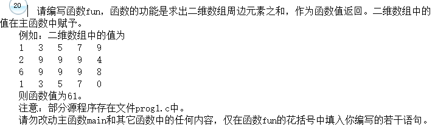

- 我可能没睡醒，写这么麻烦。。。。。

```c
#include <stdio.h>
#define  M  4
#define  N  5
int  fun ( int a[M][N] )
{
	int i,j,sum = 0;
	for(i = 0;i < M;i++)
	{
		for(j = 0;j < N;j++)
		{
			if(i==0)
				sum+=a[i][j];
			if(j==0)
				sum+=a[i][j];
			if(i==3)
				sum+=a[i][j];
			if(j==4)
				sum+=a[i][j];
		}
	}
	sum=sum-a[0][0]-a[M-1][0]-a[0][N-1]-a[M-1][N-1];
	return sum;


}

main( )
{  int  aa[M][N]={{1,3,5,7,9},
                  {2,9,9,9,4},
                  {6,9,9,9,8},
                  {1,3,5,7,0}};
   int  i, j, y;void NONO ();
   printf ( "The original data is : \n" );
   for ( i=0; i<M; i++ )
   {   for ( j =0; j<N; j++ ) printf( "%6d", aa[i][j] );
       printf ("\n");
   }
   y = fun ( aa );
   printf( "\nThe  sum:  %d\n" , y );
   printf("\n");
   NONO( );
  getchar();
}

void NONO ()
{/* 请在此函数内打开文件，输入测试数据，调用 fun 函数，
    输出数据，关闭文件。 */
  int i, j, y, k, aa[M][N] ;
  FILE *rf, *wf ;

  rf = fopen("C:\\WEXAM\\000000000000\\in.dat","r") ;
  wf = fopen("C:\\WEXAM\\000000000000\\out.dat","w") ;
  for(k = 0 ; k < 10 ; k++) {
    for(i = 0 ; i < M ; i++)
    for(j = 0 ; j < N ; j++) fscanf(rf, "%d", &aa[i][j]) ;
    y = fun ( aa );
    fprintf(wf, "%d\n", y) ;
  }
  fclose(rf) ;
  fclose(wf) ;
}
```

- 下面是代码示例，这种写法多好，简单明了，直接一遍相加就行了，我竟然脑子瓦特了。。。

```c
#include <stdio.h>
#define  M  4
#define  N  5
int  fun ( int a[M][N] )
{
	int i,j,sum = 0;
	for(i = 0;i < M;i++)
	{
		for(j = 0;j < N;j++)
		{
			if((i==0) || (i == M -1) ||(j == 0) || (j == N-1))
				sum += a[i][j];
		}
	}
	return sum;
}

main( )
{  int  aa[M][N]={{1,3,5,7,9},
                  {2,9,9,9,4},
                  {6,9,9,9,8},
                  {1,3,5,7,0}};
   int  i, j, y;void NONO ();
   printf ( "The original data is : \n" );
   for ( i=0; i<M; i++ )
   {   for ( j =0; j<N; j++ ) printf( "%6d", aa[i][j] );
       printf ("\n");
   }
   y = fun ( aa );
   printf( "\nThe  sum:  %d\n" , y );
   printf("\n");
   NONO( );
  getchar();
}

void NONO ()
{/* 请在此函数内打开文件，输入测试数据，调用 fun 函数，
    输出数据，关闭文件。 */
  int i, j, y, k, aa[M][N] ;
  FILE *rf, *wf ;

  rf = fopen("C:\\WEXAM\\000000000000\\in.dat","r") ;
  wf = fopen("C:\\WEXAM\\000000000000\\out.dat","w") ;
  for(k = 0 ; k < 10 ; k++) {
    for(i = 0 ; i < M ; i++)
    for(j = 0 ; j < N ; j++) fscanf(rf, "%d", &aa[i][j]) ;
    y = fun ( aa );
    fprintf(wf, "%d\n", y) ;
  }
  fclose(rf) ;
  fclose(wf) ;
}
```

