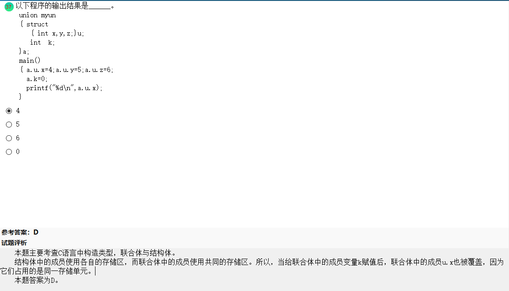

- 快速排序的基本思想是，通过一趟排序将待排序记录分割成独立的两部分，其中一部分记录的关键字小，再分别对这两部分的记录继续进行排序，以达到整个序列有序；插入排序的基本操作时将无序序列中的各元素一次插入到已经有序的线性表中，得到一个新的序列；选择排序的的基本思想是：扫描整个线性表，从中选出最小的元素，将它交换到表的最前面（这是它应有的位置），然后对剩下的子表采用同样的方法，直到表空位置；归并排序试讲两个或两个以上的有序表组合成一个新的有序表。**归并排序要求内存最大！**
- 调试的关键在于推断程序内部的错误及原因。主要的调试方法有：强行排错法、回溯法和原因排除法。
- 结构化查询语言（Structure Query Language，简称SQL）是集数据定义、数据操纵和数据控制功能于一体的数据库语言。
- extern、register、static、auto分别定义外部变量、寄存器变量、静态变量、自动变量，其中，自动变量和寄存器变量属于动态存储，调用时临时分配单元；而静态变量和外部变量属于静态存储，在整个程序运行时间都存在。
- feof(fp)函数用来检测文件位置指针是否已指向末尾，则函数值为非零值，否则函数值为0。
- strcat(str1,str2)字符串连接函数的作用是把str2 所指字符串的内容连接到str1字符串的后面，自动删去str1原来串中的’\0’。为了进行这项操作，要求str1所指的字符串后面有足够的空间来容纳str2所指的字符串中的内容。函数值为str1所指第一个第一个字符的地址。
- C语言中多维数组赋初值时可以部分赋值，如果对全部元素赋初值，则定义数组时对第一维的长度可以不指定，但第二维的长度不可以省略。

下面解析

- j结构体中的成员实用各自的存储区，而联合体中的成员实用共同的存储 区。所以，当给联合体中的成员变量k赋值后，联合体中的成员u.x也被覆盖，因为他们占用的是同一内存单元。

动态分配存储单元地址返回主调函数

 

