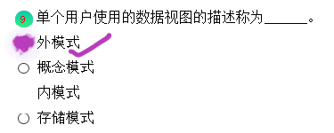
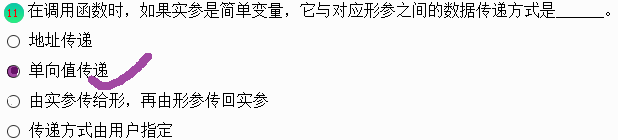
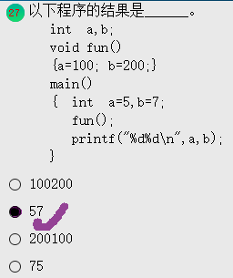
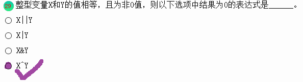
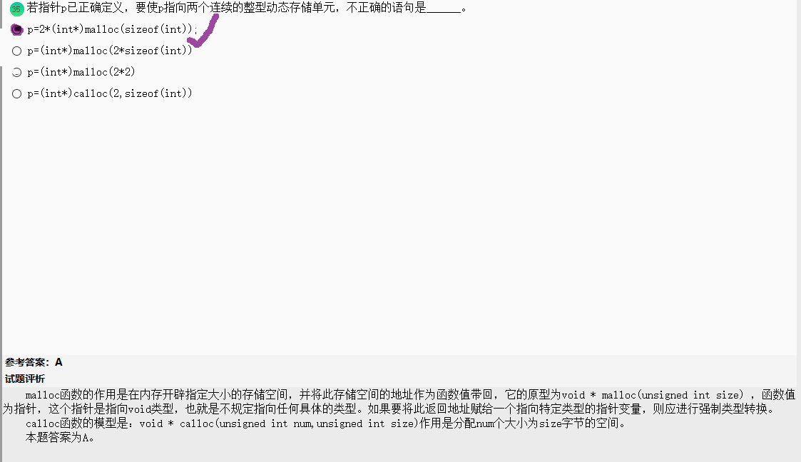
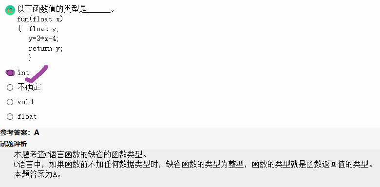

- 计算：


的前n项和。若x=2.5，n=15时，函数值为：1.917914

```c
#include    <stdio.h>
#include    <math.h>
double fun(double  x, int  n)
{  double  f, t;      int  i;
/**********found**********/
   f = 1;
   t = -1;
   for (i=1; i<n; i++)
   {
/**********found**********/
      t *= (-1)*x/i;
/**********found**********/
      f += t;
   }
   return  f;
}
main()
{  double  x, y;
   x=2.5;
   y = fun(x, 15);
   printf("\nThe result is :\n");
   printf("x=%-12.6f    y=%-12.6f\n", x, y);
   getchar();
}

```

- 常见的过程设计工具用：程序流程图、N-S图、PAD图和HIPO图。其中，为了避免流程图在描述程序逻辑时的灵活性，提出了**用方框图**来代替传统的程序流程图，通常‘也罢这种图称为**N-S图**。
- **数据处理的最小单位是数据项**；由若干数据项组成数据元素；而数据是指能够被计算机识别、存储和加工处理的信息载体；数据结构是指数据之间的相互关系和数据运算。



<center>外模式是用户的数据视图，也就是用户所见到的数据模式；全局数据视图的描述称为概念模型，即数据库中全部数据的整体逻辑结构的描述；物理存储数据视图的描述称为内模式，即数据库在物理存储方面的描述；存储模式即为内模式。</center>

- 软件设计包括结构设计、数据设计、接口设计和过程设计。其中**结构设计**是定义软件系统各主要部件之间的关系；**数据设计**是将分析时创建的模型转化为数据结构的定义；**接口设计**是描述软件内部、软件和操作系统之间及软件与人之间如何通信；**过程设计**则是把系统结构部件转换成为软件的过程行描述。
- 数据库（Database，简称DB）是数据的集合，它具有统一的结构形式并存放于统一的存储介质内，是多种应用数据的集成，并可被各个应用程序共享。数据库中的数据结构具有“集成”、“共享”的特点。



<center>本题考查C语言函数的参数的传递方式。C语言函数中的参数传递方式是值传递，指将实参的值赋值一份传递给形参，形参的改变而不影响实参，即为单项传递。</center>

- C语言中不能讲字符串常量直接赋值给一数组，但是在赋初值时可以。



<center>本题主要考察的是C语言中的变量作用域。全程变量是可以在子函数中对绝对值改变，且它也可作为函数间的值传递。当函数或子函数中定义了与全程变量名称相同的局部变量，则全程变量将被局部变量屏蔽</center>



- 对于**位于运算符(&)**来说，如果两个运算对象的对应位置都是1则运算结果中该位为1，否则为0；
- 对于**位或运算符(|)**来说，如果两个运算对象的对应位置至少有一个为1则运算结果啊中该位为1，否则为0；
- 对于**位异或运算符(^)**来说，如果两个运算都想的对应位置有且只有一个为1，则运算结果中该位为1，否则为0

<center>考察C语言的逻辑运算符。“||“为或运算符，当其左右表达式中只要一个为非零值则整个表达式的值为1。”|“是按位或，”&"是按位与，“^"是按位异或，这三个运算符是按值的二级制来比较的。</center>







