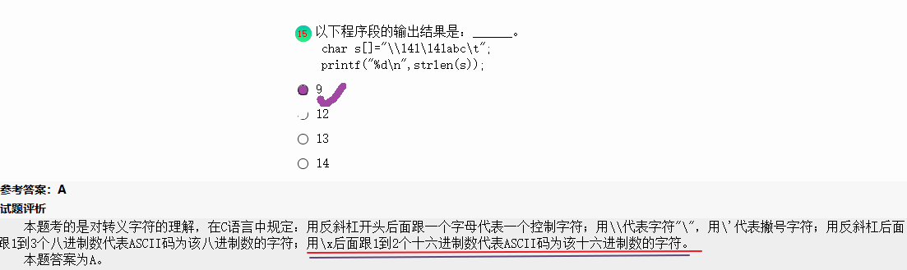
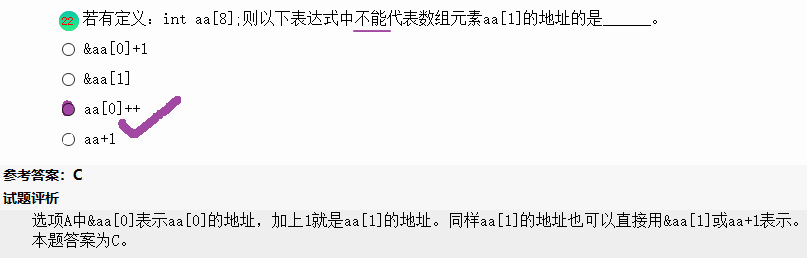
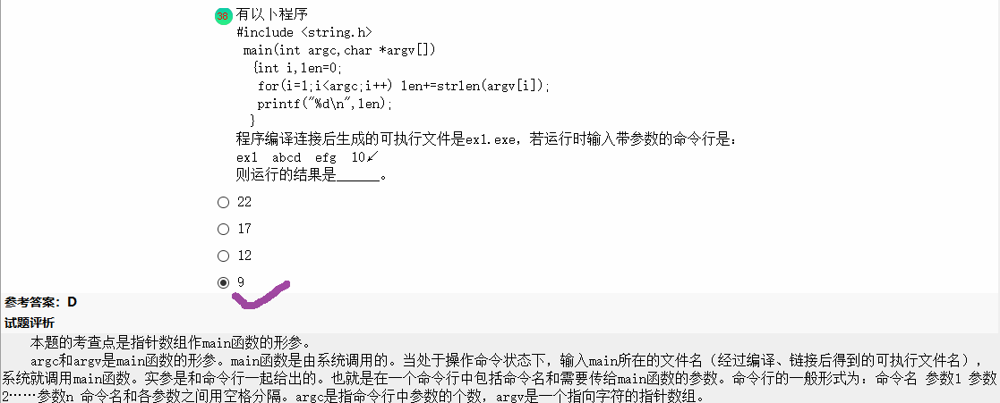
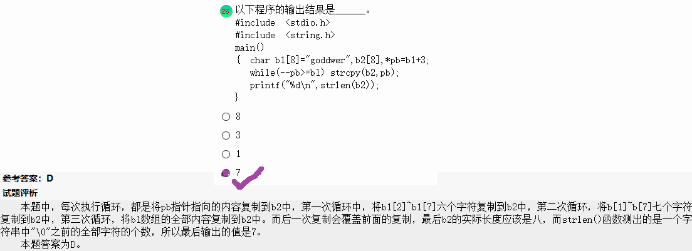

- struct 中所有的成员变量都分配了空间，所以空间大小是所有的数据类型所占的空间的总和
- union 的长度取决于其中的长度最大的那个成员变量的长度。原因：union中成员变量是重叠摆放的，起开始的地址相同。
- n个顶点的强连通图的变数至少有**n**；
  - 在有向图中，若任一两个顶点都连通，则称该图是强连通图，这样的有向图的；形状是环装，因此至少有n条边。
- 当数据表中每个元素距其最终位置不远，说明数据表按照关键字值基本有序，在待排序序列基本有序的情况下，采用插入排序所用的时间最少。

- 在数据管理技术发展过程中，文件系统与数据库系统的主要区别是数据库系统具有
  - [ ] 数据无冗余
  - [ ] 数据可共享
  - [ ] 专门的数据管理软件
  - [x] 特定的数据模型

- 解析：在文件系统中，相互独立的记录其内部结构的最简单形式是等长同格式记录的集合，易造成存储空间大量浪费，不方便使用。而在数据库系统中，数据是结构化，这种结构化要求在描述数据时不仅描述数据本身，还要描述数据间的关系，这正是通过采用**特点的数据模型**来实现的。
- 数据模型所描述的内筒有3个部分，它们是**数据结构**、**数据操作**、**数据约束**。其中，数据模型中的结构主要描述数据的类型、内容、性质，以及数据库的联系等；数据操作主要是描述在相应的数据结构上的操作类型与操作方式。










- 看不懂的题。。。




- 关于结构体应用的题，这类题写的比较少，所以不熟悉，做个记录
  - 学生的记录有学号和成绩组成，N名学生的数据已在主函数中放入结构体数组s中，请编写函数fun，它的功能是：函数返回指定学号的学生数据，指定的学号在主函数中输入。若没有找到指定学号，在结构体变量中给学号置空，给成绩置-1，作为函数值返回。

```c
#include <stdio.h>
#include <string.h>
#pragma warning (disable:4996)
#define   N   16
typedef  struct
{  char  num[10];
   int   s;
} STREC;


//重点：
STREC  fun( STREC  *a, char *b )
{ int i,f=0;
  STREC p;          
  p=a[0];
  for (i=0;i<N;i++)
   if (strcmp(a[i].num,b)==0) 
   {p=a[i];f=1;}  
  if (f==0)          
  {p.num[0]='\0';   
   p.s=-1;
  }
  return p;
}


main()
{  STREC  s[N]={{"GA005",85},{"GA003",76},{"GA002",69},{"GA004",85},
		{"GA001",91},{"GA007",72},{"GA008",64},{"GA006",87},
		{"GA015",85},{"GA013",91},{"GA012",64},{"GA014",91},
		{"GA011",77},{"GA017",64},{"GA018",64},{"GA016",72}};
   STREC  h;
   char  m[10];
   int  i;FILE *out ;
   printf("The original data:\n");
   for(i=0; i<N; i++)
   {  if(i%4==0) printf("\n");
      printf("%s %3d  ",s[i].num,s[i].s);
   }
   printf("\n\nEnter the number:  ");gets(m);
   h=fun( s,m );
   printf("The data :  ");
   printf("\n%s  %4d\n",h.num,h.s);
   printf("\n");
   out = fopen("C:\\WEXAM\\000000000000\\out.dat","w") ;
   h=fun(s,"GA013");
   fprintf(out,"%s  %4d\n",h.num,h.s);
   fclose(out);
   getchar();
}
```

