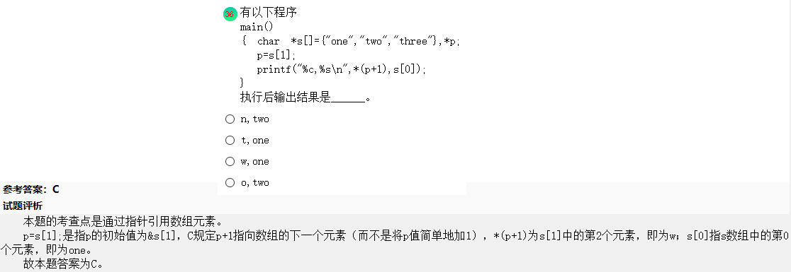
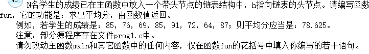

- 数据独立性是数据与程序间的互补依赖性，即数据库中数据独立于应用程序而不依赖与应用程序。也就是说，数据的逻辑结构、存储结构与存取方式的改变不会影响应用程序。
- 假设线性表的长度为n，则在最坏的情况下，冒泡排序需要经过$\frac{n}{2}$遍从前往后扫描和$\frac{n}{2}$遍的从后往前扫描，需要比较次数为$\frac{n(n-1)}{2}$,快速排序法的最坏情况比较次数也是$\frac{n(n-1)}{2}$。
- 在C语言中，可以用FILE定义指向二进制文件的文件指针。


```c
#include<iostream>
#include<string.h>
#include<malloc.h>
using namespace std;

struct STU
 {char num[10]; 
 float score[3];};
 
int main()
 {struct STU s[3]={{"20021",90,95,85},
                   {"20022",95,80,75},
                   {"20023",100,95,90}},*p=s;
 	int i; float sum=0;*p=s[1];
 	for(i=0;i<3;i++)
 	sum=sum+p->score[i];
	printf("%6.2f\n",sum);

	return 0; 
}
```


- 增长一下见识：




- 关于结构体答题的应用：



```c
#include <stdio.h>
#include <stdlib.h>
#pragma warning (disable:4996)
#define   N   8
struct  slist
{  double   s;
   struct slist  *next;
};
typedef  struct slist  STREC;
double  fun( STREC *h  )
{
	STREC *p;
	double aver = 0;
	p = h->next;
	while(p != 0)
	{
		aver = aver + p->s;  //从链表首节点开始，累计成绩之和
		p=p->next;           //p后移一个节点
	}
	aver = aver/N;
	return aver;
}

STREC * creat( double *s)
{ STREC  *h,*p,*q;   int  i=0;
  h=p=(STREC*)malloc(sizeof(STREC));p->s=0;
  while(i<N)
  { q=(STREC*)malloc(sizeof(STREC));
    q->s=s[i]; i++;  p->next=q; p=q;
  }
  p->next=0;
  return  h;
}
outlist( STREC *h)
{ STREC  *p;
  p=h->next; printf("head");
  do
  { printf("->%4.1f",p->s);p=p->next;}
  while(p!=0);
  printf("\n\n");
}
main()
{  double  s[N]={85,76,69,85,91,72,64,87},ave;
   void NONO (  );
   STREC  *h;
   h=creat( s );   outlist(h);
   ave=fun( h );
   printf("ave= %6.3f\n",ave);
   NONO();
   getchar();
}
void NONO()
{/* 本函数用于打开文件，输入数据，调用函数，输出数据，关闭文件。 */
  FILE *in, *out ;
  int i,j ; double  s[N],ave;
  STREC *h ;
  in = fopen("C:\\WEXAM\\000000000000\\in.dat","r") ;
  out = fopen("C:\\WEXAM\\000000000000\\out.dat","w") ;
  for(i = 0 ; i < 10 ; i++) {
    for(j=0 ; j < N; j++) fscanf(in, "%lf,", &s[j]) ;
    h=creat( s );
    ave=fun( h );
    fprintf(out, "%6.3lf\n", ave) ;    
  }
  fclose(in) ;
  fclose(out) ;
}
```

