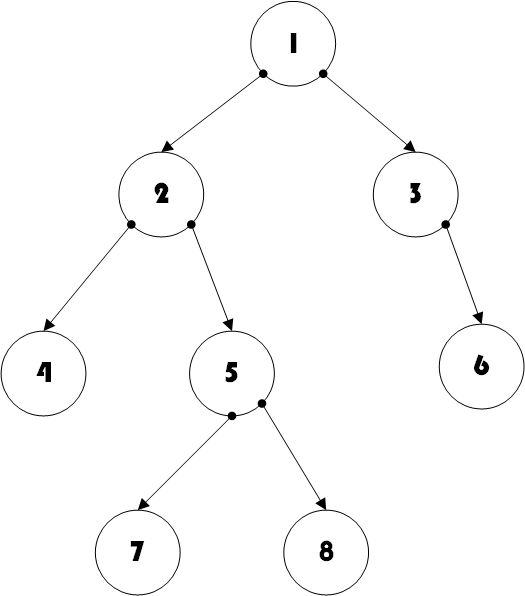

# 计算机二级笔记(C语言)
---
## 算法的的基本概念
- **算法的控制结构**给出了算法的基本框架，他不仅决定了算法中管操作的执行顺序，而且也直接反映了算法的设计是否符合结构化原则。一个算法一般都可以用**顺序、选择、循环**三种基本控制结构组合而成！
- **算法的特征**：
  1. 确定性：算法的每一步骤必须有确切的定义
  2. 有穷性：一个算法必须保证执行有限步之后结束。
  3. 可行性：算法原则上能够精确地运行，而且人们用笔和纸做有限次运算后即可完成。
  4. 输入：一个算法有0个或多个输入，以刻画运算对象的初始情况，所谓0个输入是指算法本身定除了初始条件。
  5. 输出：一个算法有一个或多个输出，以反映对输入数据加工后的结果。没有输出的算法是毫无意义的。
- **算法的组成要素**：一个算法**由数据对象的运算和操作以及控制结构**这两部分组成。
- **算法的基本运算和操作**：算术运算，逻辑运算，关系运算，数据传输。
- **算法基本设计方法**：列举法、归纳法、递推、递归、减半递推技术。
- 算法效率的度量——算法的复杂度：**时间复杂度**和**空间复杂度**。***二者并不相关***。
  - 算法时间复杂度：指执行算法所需要的计算工作量。通常，一个算法所用的时间包括编译时间和运行时间。
  - 算法空间复杂度：指执行这个算法所需要的内存空间。包括算法程序所占的空间，输入的初始数据所占的空间，算法执行过程中所需的额外空间。
- 

---

## 排序算法
1. 对于长度为n的线性表，在最坏的情况下，快速排序所需要的次数为*$ n(n-1)/2$*;冒泡排序所需要的比较次数为$n(n-1)/2$;直接插入排序所需要的比较次数为$n(n-1)/2$;希尔排序所需要的比较次数为$O(n^{1.5})$;

---
## 栈和队列
1. 循环队列不同于循环列表，**循环队列是顺序存储结构**。**循环链表是链式存储结构**。**双向链表是链式存储结构**，其中每个节点都有左指针和右指针，不同于二叉树节点的左子树和友子树指针。*非线性结构和线性结构是数据的逻辑操作*，*顺序和链式是数据的存储结构*，例如二叉树是非线性结构，也可以按照层序进行顺序存储。
2. 一般数据结构分为两大类：线性结构和非线性结构。如果一个非空的数据结构满足下列两个条件：

	-  有且只有一个根节点;
	-  每个节点最多只有一个前键和后键。
    则称该数据结构为线性结构，又称线性表。所以具有两个根节点的数据结构一定是非线性结构。

## 二叉树的遍历
- 前序遍历：根结点 ---> 左子树 ---> 右子树
- 中序遍历：左子树---> 根结点 ---> 右子树
- 后序遍历：左子树 ---> 右子树 ---> 根结点
- 层次遍历：只需按层次遍历即可

- 前序遍历：1  2  4  5  7  8  3  6 
- 中序遍历：4  2  7  5  8  1  3  6
- 后序遍历：4  7  8  5  2  6  3  1
- 层次遍历：1  2  3  4  5  6  7  8

## C语言基础语法
- 对象是有数据和容许的操作组成的封装体，与客观事实有直接的对应关系。对象之间通过传递消息相互联系，以模拟现实世界中不同事物彼此之间的联系。

## 软件设计

- 软件设计过程中，必须遵守软件工程的基本原则：**抽象、信息隐蔽、模块化、局部化、确定性、一致性、完备性和可靠性**。
- 面向对象的设计方法与传统的面向过程的方法有本质的区别，他的基本原理是，使用现实世界中的概念抽象地思考问题从而自然地解决问题。他强调模拟现实世界中的概念而不强调算法，它鼓励开发者在软件开发的绝大部分都应用领域的概念去思考。
- 良好的程序设计风格可以使程序结构合理，是程序代码便于维护。
    1.  源程序要文档化；
    2.  数据说明的次序要规范化；
    3.  语句的结构应该简单直接，不应该为提高效率而把语句复杂化，避免滥用goto语句。模块设计要保低耦合、高内聚。

## 数据库

- 关系数据模型的三个组成部分包括：数据操作，数据结构，完整性约束。

   
